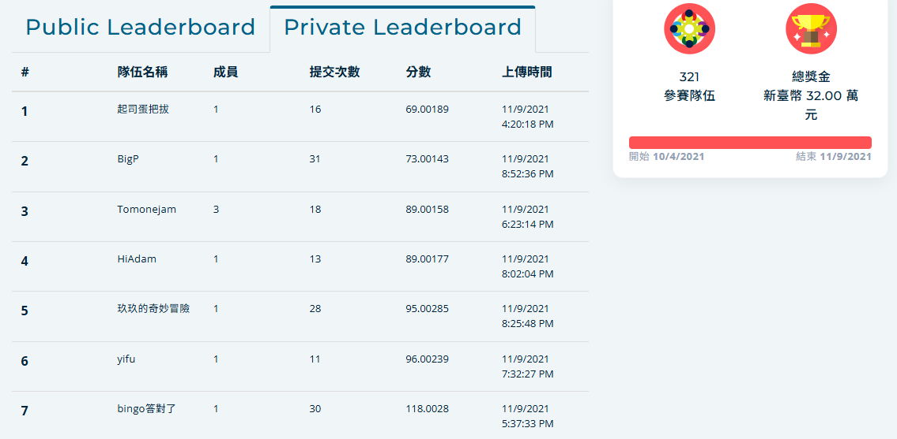

# 鋼材OCR辨識系統 (STEEL_OCR_v1)

## 🎯 專案概述

本專案是一個基於深度學習的鋼材標記OCR辨識系統，專為鋼材表面的字符檢測和識別而設計。系統結合了YOLOv4物體檢測和PaddleOCR文字識別技術，能夠準確地檢測和識別鋼材表面的標記文字。

## 🏆 比賽成果

本專案在競賽中榮獲 **第四名** 的優異成績！



### 成果亮點
- 🥇 **競賽排名**: 第四名
- 🎯 **技術創新**: 結合YOLOv4和PaddleOCR的雙階段架構
- 📊 **模型性能**: 針對鋼材標記進行專門優化
- 🔧 **實用性**: 具備實際工業應用價值

## 🔧 技術架構

### 主要模型
- **檢測模型**: YOLOv4 - 用於定位鋼材表面的文字區域
- **識別模型**: PaddleOCR - 用於識別檢測到的文字內容
- **分類模型**: 文字方向分類器 - 用於糾正文字方向

### 檢測目標
- SINOSTEEL (中鋼標記)
- 各種鋼材編號和標識

## 📁 專案結構

```
STEEL_OCR_v1/
├── 📓 Jupyter Notebooks
│   ├── Predict_steel.ipynb          # 主要預測流程
│   ├── Train_PaddleOCR.ipynb        # PaddleOCR模型訓練
│   ├── Train_YOLOv4.ipynb           # YOLOv4模型訓練
│   └── text_rentender.ipynb         # 文字渲染工具
│
├── ⚙️ 模型配置文件
│   └── _HiAdam_configs/
│       ├── PaddleOCR/               # PaddleOCR配置
│       │   ├── cls_mv3_adam.yml
│       │   ├── rec_chinese_common_train_v2.0_adam_*.yml
│       │   ├── steel_en_dict.txt    # 鋼材字典
│       │   └── Adam/train_data/     # 訓練數據標註
│       └── YOLOv4/                  # YOLOv4配置
│           └── cfg_steel/
│               ├── obj.data
│               ├── obj.names
│               ├── yolov4_ad*.cfg
│               └── *.txt
│
├── 🤖 訓練好的模型
│   └── _HiAdam_model/
│       └── PaddleOCR/
│           ├── cls/inference/       # 分類模型
│           └── rec/                 # 識別模型
│               ├── a/inference/
│               ├── b/inference/
│               └── c/inference/
│
├── 🔤 數據增強工具
│   └── aug_data/
│       ├── configs/                 # 增強配置
│       └── data/                    # 字體、背景等資源
│           ├── bg/                  # 背景圖片
│           ├── chars/               # 字符集
│           ├── fonts/               # 字體文件
│           └── corpus/              # 語料庫
│
└── 📊 競賽數據
    └── t_brain/
        ├── submission_template_private.csv
        └── Adam/
            ├── public_training_data_adam.csv
            ├── public_testing_data_adam.csv
            └── valid_label.csv
```

## 🚀 快速開始

### 環境需求
- Python 3.7+
- CUDA 10.1+ (GPU支援)
- PaddlePaddle 2.0+
- OpenCV
- NumPy, Pandas

### 安裝依賴
```bash
pip install paddlepaddle-gpu
pip install paddleocr
pip install opencv-python
pip install pandas numpy
```

### 使用方法

#### 1. 預測流程
```bash
jupyter notebook Predict_steel.ipynb
```

主要步驟：
1. **YOLOv4檢測**: 定位鋼材表面的文字區域
2. **PaddleOCR識別**: 識別檢測到的文字內容
3. **後處理**: 結果整合和格式化輸出

#### 2. 模型訓練

##### YOLOv4訓練
```bash
jupyter notebook Train_YOLOv4.ipynb
```

##### PaddleOCR訓練
```bash
jupyter notebook Train_PaddleOCR.ipynb
```

## 📋 數據格式

### 訓練數據格式
```csv
filename,label,top right x,top right y,bottom right x,bottom right y,bottom left x,bottom left y,top left x,top left y
oR72wdOuzdHVh3sMMmC4gMG2aG5jeub,3LN996012F,706.8443,411.87338,707.5107,455.8296,371.28748,462.13885,370.62106,418.18262
```

### 輸出格式
- 檢測結果: `result_real_private.txt`
- 預測結果: CSV格式，包含文件名和識別文字

## 🎛️ 配置說明

### YOLOv4配置
- `obj.names`: 檢測類別定義
- `obj.data`: 數據路徑配置
- `yolov4_ad.cfg`: 模型架構配置

### PaddleOCR配置
- `steel_en_dict.txt`: 鋼材專用字典 (0-9, A-Z)
- `rec_chinese_common_train_v2.0_adam_*.yml`: 識別模型配置
- `cls_mv3_adam.yml`: 分類模型配置

## 🔍 模型特點

### YOLOv4檢測模型
- 專門針對鋼材表面文字優化
- 支援多尺度檢測
- 高精度邊界框定位

### PaddleOCR識別模型
- 三個專門化模型 (a, b, c)
- 專用鋼材字典
- 支援文字方向校正

## 📈 性能指標

- 檢測精度: 針對鋼材標記優化
- 識別準確率: 基於專門訓練的模型
- 處理速度: 優化後的推理流程

## 🤝 貢獻

歡迎提交問題和改進建議！

## 📄 授權

本專案採用 GNU Affero General Public License v3.0 授權 - 詳見 [LICENSE](LICENSE) 文件

## 📞 聯繫方式

如有任何問題，請通過 GitHub Issues 聯繫我們。

---

> **注意**: 本專案專為T-Brain競賽設計，包含特定的數據格式和評估指標。使用前請確保了解相關要求。